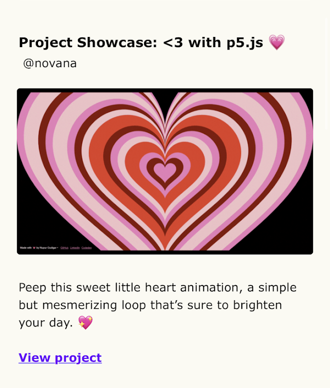

# Heart Screen

	A full-screen p5.js love-art sketch that layers animated hearts in shifting shades of pink and red.

	

	<a href="https://nupur-gudigar.github.io/Heart-Screen/">Live Site</a>
	·
	<a href="#preview">Preview</a>
	·
	<a href="#recognition">Recognition</a>

---

## Preview

	

The preview above uses the uploaded gif at `assets/heart-screen-demo.gif`.

## About

Heart Screen is a simple, visually immersive p5.js sketch built around a centered field of pulsing hearts. It uses layered heart shapes, looping motion, and a black background to keep the composition bold and minimal.

The project also includes a small credit footer in the sketch linking to the creator's GitHub, LinkedIn, and Codedex profile.

## Features

- Full-window canvas that scales to the browser viewport.
- Animated heart forms in multiple shades of pink and red.
- Continuous looping motion that recycles hearts as they shrink.
- Minimal overlay credits inside the sketch.

## Tech Stack

- p5.js
- HTML5
- CSS3
- JavaScript

## Recognition

This project was featured as a Staff Pick on Codedex and was also mentioned in a Codedex tech newsletter.

## Featured On

	<a href="https://www.codedex.io/community/project-showcase/rzYWU9K50XJhEGexeO3g">Codedex Staff Pick feature</a>

<strong>Tech newsletter "Codedex" featured it.</strong>

	

## Files

- `index.html` loads p5.js and the sketch.
- `sketch.js` contains the animation and drawing logic.
- `style.css` keeps the canvas edge-to-edge.

## Live Demo

[Open the live site](https://nupur-gudigar.github.io/Heart-Screen/)
